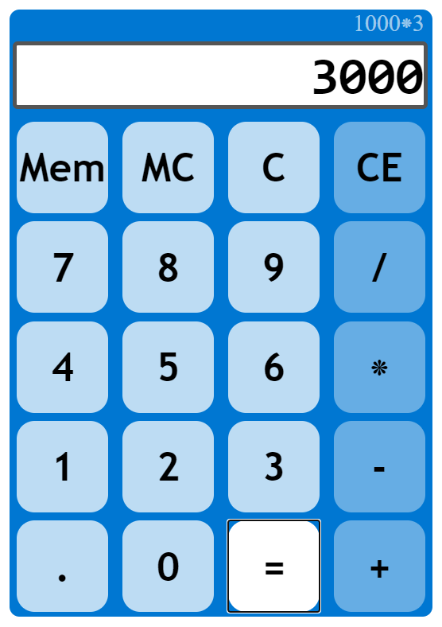

# Lazy Math Calculator

Javascript calculator for when counting is inconvenient.

view <a href="https://duanemcd.github.io/calculator/"> Lazy Math Calculator</a>!

## Summary

A modern math machine. Add, Subtract, multiply and divide. Crunch numbers like never before.

## Features

<ul>
  <li>Simple Math Functions</li>
  <li>Responsive</li>
  <li>Single number Memory</li>
  <li>Simple UI</li>
</ul>

### Author

Duane McDonald | Software Developer  
<a href="https://www.linkedin.com/in/duane-mcdonald-48a90136">linkedIn</a>  
<a href="https://www.DuaneMcDonald.com">Personal Website</a>  
